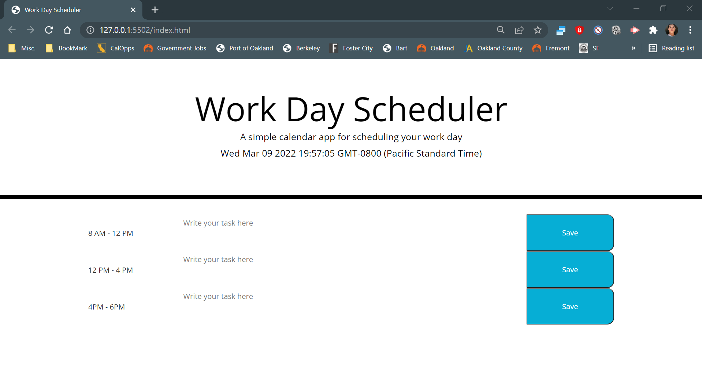

# Work Day Scheduler Starter Code

Show Time and Date on Top for Webpage with Javascript built-in Date() function

divide planner into morning, noon and night

allow input into text area and click save to save

Live Page:
https://dn691997.github.io/daily-planner/

GitHub Repo:
https://github.com/dn691997/daily-planner

